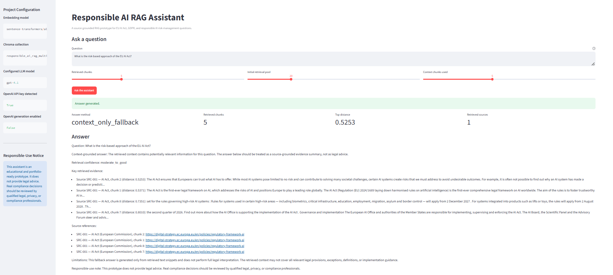
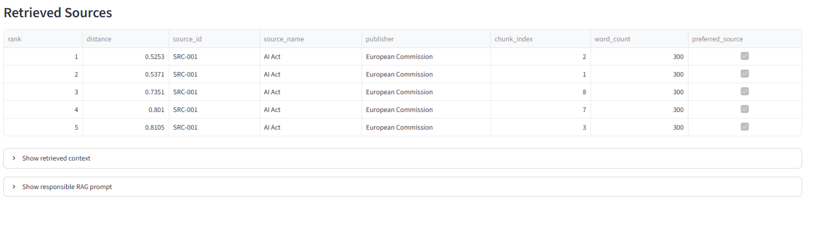

# Responsible AI RAG Assistant

## AI Governance, GDPR, and EU AI Act Knowledge Support

This project is a source-grounded **Responsible AI Retrieval-Augmented Generation (RAG) assistant** for questions related to the **EU AI Act**, **GDPR**, and **NIST AI Risk Management Framework (AI RMF)**.

The assistant retrieves relevant information from selected authoritative public sources, formats the retrieved evidence, applies responsible-use guardrails, and generates a structured answer in a reproducible fallback mode. The project also includes an optional OpenAI-assisted generation path, which is disabled by default for safe and reproducible portfolio demonstration.

---

## Project Status

**Portfolio-ready prototype**

The project includes:

- Public-source collection and source inventory
- Text extraction from official web pages and PDF sources
- Document chunking
- Sentence-transformer embedding generation
- Chroma vector-store creation
- Multi-source retrieval
- Source-aware retrieval evaluation
- Context-grounded fallback answer generation
- Optional OpenAI LLM generation pathway
- Responsible-use guardrails
- CLI testing interface
- Streamlit demo application

---

## Important Responsible-Use Notice

This project is an educational and portfolio-ready prototype.

It does **not** provide legal advice.  
It does **not** replace qualified legal, privacy, compliance, or regulatory review.  
Real compliance decisions should always be reviewed by qualified professionals.

The assistant is designed to demonstrate responsible AI system design patterns, including:

- Source-grounded retrieval
- Transparent retrieved evidence
- Explicit disclaimers
- Fallback behavior when LLM generation is disabled or unavailable
- Separation between local secrets and public repository files

---

## Key Features

### 1. Multi-source knowledge base

The project uses selected public and authoritative sources covering:

- EU AI Act overview and implementation guidance
- Regulation (EU) 2024/1689 Artificial Intelligence Act
- Regulation (EU) 2016/679 General Data Protection Regulation
- NIST AI Risk Management Framework AI RMF 1.0
- NIST AI RMF overview material

### 2. Retrieval-Augmented Generation pipeline

The project builds a structured RAG workflow:

1. Load source inventory
2. Extract and clean source text
3. Chunk documents into retrieval-ready segments
4. Generate embeddings using `sentence-transformers/all-MiniLM-L6-v2`
5. Store chunks and embeddings in Chroma
6. Retrieve relevant chunks for user questions
7. Format retrieved context
8. Generate source-grounded answers
9. Display retrieved sources and confidence information

### 3. Source-aware retrieval

The retrieval pipeline includes lightweight source-awareness logic. For example:

- GDPR questions are routed toward GDPR source material
- NIST AI risk-management questions are routed toward NIST sources
- EU AI Act questions are routed toward EU AI Act sources

This improves retrieval relevance and makes the system easier to inspect.

### 4. Responsible AI guardrails

The assistant includes guardrails such as:

- No legal advice
- No unsupported certainty beyond retrieved context
- Source-aware answer generation
- Retrieved chunk references
- Responsible-use disclaimer
- Fallback mode when API generation is unavailable or disabled

### 5. Reproducible fallback mode

The repository is designed to run without paid OpenAI API usage.

By default:

```env
ENABLE_OPENAI_GENERATION=False
```

This allows the assistant to generate structured, context-grounded fallback answers from retrieved chunks without calling an external LLM.

### 6. Optional OpenAI generation

The project includes an optional OpenAI-assisted answer-generation path. To use it locally, create a `.env` file from `.env.example` and configure your own API key.

The real `.env` file is intentionally excluded from GitHub.

---

## Repository Structure

```text
responsible-ai-rag-assistant/
├── app/
│   └── streamlit_app.py
│
├── data/
│   └── README.md
│
├── docs/
│   ├── project_plan.md
│   └── source_register.md
│
├── images/
│   ├── streamlit_app_answer.png
│   └── streamlit_app_sources.png
│
├── notebooks/
│   ├── 01_document_ingestion_and_chunking.ipynb
│   ├── 02_embeddings_and_vector_store.ipynb
│   ├── 03_rag_question_answering.ipynb
│   ├── 04_source_expansion_and_retrieval_evaluation.ipynb
│   ├── 05_multisource_vector_store_and_retrieval_evaluation.ipynb
│   └── 06_llm_rag_assistant_and_guardrails.ipynb
│
├── reports/
│
├── src/
│   ├── __init__.py
│   ├── config.py
│   ├── rag_pipeline.py
│   └── run_rag_cli.py
│
├── tests/
│
├── .env.example
├── .gitignore
├── LICENSE
├── README.md
└── requirements.txt
```

---

## Data and Artifact Policy

The repository intentionally does **not** include raw downloaded files, processed chunks, embeddings, or local vector-store artifacts.

The following local folders are excluded through `.gitignore`:

```text
data/raw/
data/processed/
data/vector_store/
```

This keeps the public repository lightweight and avoids uploading generated or potentially large local artifacts.

To reproduce the full workflow locally, run the notebooks in order.

---

## Main Technologies

- Python
- pandas
- NumPy
- sentence-transformers
- ChromaDB
- Streamlit
- OpenAI Python SDK
- Jupyter Notebook
- Git / GitHub

---

## Installation

Clone the repository:

```bash
git clone https://github.com/mahdidadgar-data/responsible-ai-rag-assistant.git
cd responsible-ai-rag-assistant
```

Create and activate a virtual environment:

```bash
python -m venv .venv
```

On Windows PowerShell:

```powershell
.\.venv\Scripts\Activate.ps1
```

Install dependencies:

```bash
pip install -r requirements.txt
```

---

## Environment Configuration

Copy the example environment file:

```bash
copy .env.example .env
```

Then edit `.env` locally.

Example:

```env
OPENAI_API_KEY=your_openai_api_key_here
OPENAI_MODEL=gpt-4.1
ENABLE_OPENAI_GENERATION=False
EMBEDDING_MODEL=sentence-transformers/all-MiniLM-L6-v2
```

Important:

- `.env` must stay local.
- `.env` must not be uploaded to GitHub.
- The project works in fallback mode when OpenAI generation is disabled.

---

## Streamlit Demo Preview

The project includes a local Streamlit interface for asking Responsible AI, EU AI Act, GDPR, and NIST AI RMF questions.

### Answer view



### Retrieved sources view



The interface shows the generated answer, retrieval method, number of retrieved chunks, top retrieval distance, retrieved source count, and a retrieved-sources table for transparency.

---

## Usage

### 1. Run the Streamlit app

From the project root:

```bash
streamlit run app/streamlit_app.py
```

The app provides a simple interface for asking questions, viewing retrieved sources, and inspecting the responsible RAG prompt.

Example questions:

```text
What is the risk-based approach of the EU AI Act?
```

```text
What is personal data under the GDPR?
```

```text
What does NIST say about managing AI risks?
```

---

### 2. Run the CLI interface

From the project root:

```bash
python src/run_rag_cli.py "What is personal data under the GDPR?"
```

Example:

```bash
python src/run_rag_cli.py "What does NIST say about managing AI risks?"
```

The CLI prints:

- Answer method
- Preferred sources
- Retrieved sources
- Retrieved chunks
- Top retrieval distance
- Source-grounded fallback answer
- Responsible-use note

---

## Notebook Workflow

The project is documented through six development notebooks.

### Notebook 01 — Document Ingestion and Chunking

Creates the initial source register, collects source text, and prepares the first source chunks.

### Notebook 02 — Embeddings and Vector Store

Generates embeddings and creates the first Chroma vector store.

### Notebook 03 — RAG Question Answering

Builds the first context-only RAG answer pipeline and tests baseline retrieval.

### Notebook 04 — Source Expansion and Retrieval Evaluation

Adds additional authoritative sources and evaluates retrieval coverage across EU AI Act, GDPR, and NIST-related questions.

### Notebook 05 — Multi-source Vector Store and Retrieval Evaluation

Creates the multi-source Chroma collection and compares baseline retrieval against source-aware retrieval.

### Notebook 06 — LLM RAG Assistant and Guardrails

Adds optional OpenAI generation, fallback-mode answer generation, guardrails, and final RAG assistant testing.

---

## Retrieval Evaluation Summary

The project evaluates retrieval quality across representative questions covering:

- EU AI Act risk-based approach
- High-risk AI obligations
- AI transparency
- GDPR personal data
- GDPR processing principles
- NIST AI risk management
- NIST AI RMF functions
- Responsible AI governance

The source-aware retrieval setup improves source matching and provides more transparent retrieval diagnostics.

---

## Example Output

For a GDPR question, the assistant retrieves GDPR-related chunks and returns a context-grounded answer with a responsible-use disclaimer.

Example metadata:

```text
Answer method: context_only_fallback
Retrieved sources: ['SRC-003']
Retrieved chunks: 5
Retrieval confidence: source_matched_moderate
```

For a NIST AI risk-management question, the assistant retrieves NIST AI RMF sources.

Example metadata:

```text
Answer method: context_only_fallback
Retrieved sources: ['SRC-005', 'SRC-004']
Retrieved chunks: 5
Retrieval confidence: moderate_to_good
```

---

## Security and Secret Handling

This project follows basic repository safety practices:

- `.env` is excluded from Git
- API keys are not committed
- Virtual environments are excluded
- Raw and processed data are excluded
- Chroma vector-store files are excluded
- Python cache files are excluded

The public repository includes `.env.example` only as a safe template.

---

## Limitations

This project is a portfolio prototype and has several limitations:

- It is not a legal advice system.
- It uses a small curated source set.
- Retrieval quality depends on chunking, source coverage, and embedding behavior.
- Fallback answers are extractive and evidence-summary based.
- OpenAI-assisted generation is optional and disabled by default.
- The Streamlit app is intended for local demonstration, not production deployment.

---

## License and Use Restrictions

This repository is provided publicly for portfolio review, educational demonstration, and employment evaluation purposes only.

No permission is granted to copy, modify, distribute, sublicense, sell, commercialize, or reuse this software, source code, documentation, workflows, or project structure without prior written permission from the copyright holder.

See the `LICENSE` file for details.

---

## Author

**Mahdi Dadgar**  
PhD-trained analytical professional transitioning into Data Science, Machine Learning, and Responsible AI systems.

GitHub: `mahdidadgar-data`

---

## Project Purpose

This project was built to demonstrate practical skills in:

- Responsible AI system design
- Retrieval-Augmented Generation
- AI governance knowledge support
- Source-grounded answer generation
- Python project structuring
- Vector-store based semantic search
- Streamlit application development
- Reproducible AI/ML portfolio engineering